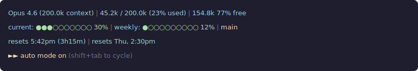

# dev-ai-guidelines

Playbook de desenvolvimento apoiado por agentes de IA — focado em Claude Code e Cursor.

Contém prompts, templates, hooks, comandos e scripts de setup para estruturar
projetos, automatizar fluxos e integrar agentes de IA ao ciclo diário de desenvolvimento.

---

## Setup em 2 comandos

```bash
# 1. Uma vez por máquina — instala tudo globalmente
cd dev-ai-guidelines
chmod +x scripts/setup-global.sh
./scripts/setup-global.sh

# 2. Uma vez por projeto — adiciona hooks do time
cd seu-projeto
/caminho/para/dev-ai-guidelines/scripts/setup-project.sh
git add .claude/ .cursor/ && git commit -m "chore: add ai hooks for team workflow"
```

**Windows (PowerShell):**
```powershell
.\scripts\setup-global.ps1   # uma vez por máquina
.\scripts\setup-project.ps1  # uma vez por projeto (rodar de dentro do projeto)
```

---

## O que o setup instala

### `setup-global` — pessoal, nunca commitado

| O que | Onde | Descrição |
|---|---|---|
| `CLAUDE.md` global | `~/.claude/CLAUDE.md` | Regras de orquestração multi-agente para todos os projetos |
| Comandos `/ai:*` | `~/.claude/commands/ai/` | 18 comandos prontos em qualquer projeto |
| Hooks Claude Code | `~/.claude/settings.json` | startup-check, intercept-clear, post-compact, post-clear-orient, block-dangerous, block-env-files, session-log |
| Hooks Cursor | `~/.cursor/hooks.json` | startup-check, block-dangerous, session-log |
| Scripts | `~/.claude/hooks/` e `~/.cursor/hooks/scripts/` | Scripts shell e Node.js |
| ~~Prompts~~ | ~~`~/.claude/prompts/`~~ | Hooks não dependem mais de prompts — direcionam para `/ai:*` diretamente |

### `setup-project` — commitado, vale para o time

| O que | Onde | Descrição |
|---|---|---|
| `settings.json` | `.claude/settings.json` | format-on-edit + require-tests |
| `hooks.json` | `.cursor/hooks.json` | format-on-edit + require-tests |
| Template de plano | `.claude/plans/active-plan.md` | Handoff de sessão |

---

## Comandos `/ai:*` disponíveis após setup

| Comando | Quando usar |
|---|---|
| `/ai:setup` | Projeto novo — cria CLAUDE.md, agents, skills |
| `/ai:update` | Projeto existente — gap analysis antes de mudar |
| `/ai:docs` | Gera ou atualiza `PROJECT.md` |
| `/ai:ask <pergunta>` | Responde perguntas sobre o projeto com base na documentação — sem escanear o codebase |
| `/ai:task <descrição>` | Início de qualquer tarefa — plano antes do código |
| `/ai:task-finish <nome>` | Marca tarefa como concluída — resumo final e arquiva o plano |
| `/ai:task-delete <nome>` | Descarta tarefa que não será executada — remove ou arquiva com motivo |
| `/ai:handoff <nome-da-tarefa>` | Salva estado de uma tarefa antes de `/clear` ou encerrar |
| `/ai:resume [nome-da-tarefa]` | Retoma tarefa salva — lista disponíveis se nome omitido |
| `/ai:daily-close` | Final do dia — gera resumo do progresso e pendências |
| `/ai:daily-start` | Início do dia — briefing com contexto do dia anterior |
| `/ai:review` | Antes de abrir qualquer PR |
| `/ai:debt` | Auditoria periódica de dívida técnica |
| `/ai:db-audit [paths]` | Auditoria de banco de dados — schema, migrations, indexes, modelagem e plano de acao |
| `/ai:bug <sintoma>` | Diagnóstico de bug — root cause antes de qualquer fix |
| `/ai:feature <descrição>` | Feature cross-componente — contrato antes dos agentes |
| `/ai:add <caminho>` | Novo componente adicionado — integração cirúrgica na estrutura existente |
| `/ai:status` | Visão rápida da sessão — tarefa ativa, planos abertos, git, daily |

### Fluxo handoff/resume (múltiplas tarefas em paralelo)

```
/ai:handoff migrar-auth-oauth2    # salva em .claude/plans/migrar-auth-oauth2.md
/ai:handoff refatorar-pagamentos  # salva em .claude/plans/refatorar-pagamentos.md
/clear

# nova sessão
/ai:resume                        # lista todas as tarefas salvas
/ai:resume migrar-auth-oauth2     # retoma direto uma tarefa específica
```

### Fluxo diário (controle semanal de progresso)

```
# final do dia
/ai:daily-close                   # gera .claude/dailies/2026-04-17.md

# manhã seguinte
/ai:daily-start                   # lê o daily mais recente e apresenta briefing
```

Os dailies são resumos leves — referenciam os planos em `.claude/plans/` sem duplicar conteúdo. Útil para manter visibilidade do progresso ao longo da semana.

---

## Hooks — descrição detalhada

Hooks são scripts que disparam automaticamente em eventos do Claude Code ou Cursor. Executam validações, injeções de contexto e automações sem intervenção manual.

### Hooks globais (instalados por `setup-global`)

| Hook | Evento | Descrição |
|---|---|---|
| **startup-check** | `SessionStart` (startup) | Detecta se o projeto tem `CLAUDE.md` e `.claude/agents/`. Se ausentes, direciona para `/ai:setup`. |
| **intercept-clear** | `UserPromptSubmit` | Intercepta `/clear` — se há tarefa ativa, sugere `/ai:handoff` antes de limpar. Ignora silenciosamente se não há tarefa. |
| **post-compact** | `SessionStart` (compact) | Após `/compact`, lê o plano da tarefa ativa via `.active-sessions.json` e reinjecta para reorientação. |
| **post-clear-orient** | `SessionStart` (clear) | Após `/clear`, reinjecta estado e próximos passos da tarefa ativa. Sugere `/ai:resume` para retomada completa. |
| **block-dangerous** | `PreToolUse` (Bash) | Bloqueia comandos destrutivos (`rm -rf /`, `drop database`, `git push --force`, etc.) e leitura de `.env` via shell antes da execução. Atua como rede de segurança em qualquer projeto. |
| **block-env-files** | `PreToolUse` (Read\|Write\|Edit) | Bloqueia leitura e escrita em arquivos de ambiente (`.env`, `.env.*`, `environment.ts/js`). Permite apenas `.env.example`. |
| **session-log** | `Stop` | Registra fim de sessão com timestamp em `.claude/logs/sessions.log`, limpa registro de tarefa ativa e envia notificação desktop (macOS/Linux). |

### Hooks por projeto (instalados por `setup-project`)

| Hook | Evento | Descrição |
|---|---|---|
| **format-on-edit** | `PostToolUse` (Edit/Write/MultiEdit) | Roda o formatador do projeto automaticamente após qualquer edição. Detecta a stack (prettier, black, gofmt, etc.) e aplica o formatador correto. |
| **require-tests** | `PreToolUse` (create_pull_request) | Bloqueia abertura de PR se os testes não estiverem passando. Detecta o runner (npm test, pytest, go test, etc.) e executa automaticamente. |

### Equivalência Claude Code / Cursor

| Função | Claude Code (bash) | Cursor (Node.js) |
|---|---|---|
| Startup check | `hooks/startup-check.sh` | `hooks-cursor/scripts/startup-check.mjs` |
| Block dangerous | `hooks/block-dangerous.sh` | `hooks-cursor/scripts/block-dangerous.mjs` |
| Session log | `hooks/session-log.sh` | `hooks-cursor/scripts/session-log.mjs` |
| Format on edit | `hooks/format-on-edit.sh` | `hooks-cursor/scripts/format-on-edit.mjs` |
| Require tests | `hooks/require-tests.sh` | `hooks-cursor/scripts/require-tests.mjs` |
| Intercept clear | `hooks/intercept-clear.sh` | _(sem equivalente Cursor)_ |
| Post compact | `hooks/post-compact.sh` | _(sem equivalente Cursor)_ |
| Post clear orient | `hooks/post-clear-orient.sh` | _(sem equivalente Cursor)_ |

---

## Cursor Rules — equivalentes dos comandos `/ai:*`

O Cursor não tem slash commands com argumentos. Em vez disso, usa **rules** (`.mdc`) ativadas por contexto ou manualmente. As Cursor rules equivalentes ficam em `cursor/rules/`:

| Claude Code | Cursor Rule | Ativação |
|---|---|---|
| `/ai:setup` | `setup-project.mdc` | Manual |
| `/ai:update` | `gap-analysis.mdc` | Manual |
| `/ai:docs` | `project-documentation.mdc` | Manual |
| `/ai:task` | `task-start.mdc` | Manual |
| `/ai:task-finish` | `task-finish.mdc` | Manual — pede nome da tarefa |
| `/ai:task-delete` | `task-delete.mdc` | Manual — pede nome da tarefa |
| `/ai:handoff` | `session-handoff.mdc` | Manual — pede nome da tarefa |
| `/ai:resume` | `session-resume.mdc` | Manual — lista tarefas se nome omitido |
| `/ai:daily-close` | `daily-close.mdc` | Manual |
| `/ai:daily-start` | `daily-start.mdc` | Manual |
| `/ai:review` | `code-review.mdc` | Manual |
| `/ai:debt` | `tech-debt-audit.mdc` | Manual |
| `/ai:bug` | `bug-diagnosis.mdc` | Manual |
| `/ai:feature` | `cross-component-feature.mdc` | Manual |
| `/ai:ask` | _(sem equivalente Cursor)_ | — |
| `/ai:status` | _(sem equivalente Cursor)_ | — |

#### Cursor Rules de agentes

| Agente | Cursor Rule | Ativação |
|---|---|---|
| `code-reviewer` | `code-reviewer.mdc` | Manual |
| `architect` | `architect.mdc` | Manual |
| `qa-engineer` | `qa-engineer.mdc` | Manual |
| `security-reviewer` | `security-reviewer.mdc` | Manual |
| `tech-debt-auditor` | `tech-debt-auditor.mdc` | Manual |
| `db-auditor` | _(sem equivalente Cursor)_ | — |

---

## Estrutura do repositório

```
dev-ai-guidelines/
├── assets/
│   └── statusline-preview.svg  # Preview visual da statusline
│
├── scripts/                    # Setup automatizado (global + projeto)
│   ├── setup-global.sh / .ps1  # Instala hooks, comandos e CLAUDE.md global
│   ├── setup-project.sh / .ps1 # Instala hooks do projeto (commitável)
│   └── README.md
│
├── commands/ai/                # Comandos /ai:* para Claude Code
│   ├── setup.md   update.md   docs.md   add.md   ask.md
│   ├── task.md    task-finish.md  task-delete.md
│   ├── handoff.md  resume.md
│   ├── daily-close.md  daily-start.md
│   ├── review.md  debt.md  db-audit.md  bug.md  feature.md  status.md
│
├── hooks/                      # Hooks Claude Code — bash (macOS/Linux)
│   ├── startup-check.sh        # Detecta projeto sem CLAUDE.md
│   ├── intercept-clear.sh      # Força handoff antes de /clear
│   ├── post-compact.sh         # Reorienta após /compact
│   ├── post-clear-orient.sh    # Reorienta após /clear
│   ├── block-dangerous.sh      # Bloqueia comandos destrutivos + leitura de .env via shell
│   ├── block-env-files.sh      # Bloqueia Read/Write/Edit em .env e environment.*
│   ├── format-on-edit.sh       # Auto-formata após edições
│   ├── require-tests.sh        # Bloqueia PR se testes falhando
│   ├── session-log.sh          # Log + notificação desktop
│   ├── settings.json           # Configuração de referência
│   └── INSTALL.md
│
├── hooks-cursor/               # Hooks Cursor — Node.js (cross-platform)
│   ├── scripts/*.mjs           # Equivalentes dos hooks bash em Node.js
│   ├── hooks.json              # Configuração de referência
│   └── INSTALL.md              # Notas de compatibilidade Windows
│
├── cursor/rules/               # Cursor Rules — equivalentes dos /ai:*
│   ├── session-handoff.mdc     # Handoff com nome de tarefa
│   ├── session-resume.mdc      # Retomada de tarefa salva
│   ├── task-finish.mdc         # Conclusão formal de tarefa
│   ├── task-delete.mdc         # Descarte de tarefa não executada
│   ├── daily-close.mdc         # Resumo de final do dia
│   ├── daily-start.mdc         # Briefing de início do dia
│   ├── task-start.mdc          # Início de tarefa com plano
│   ├── setup-project.mdc       # Setup de projeto novo
│   ├── gap-analysis.mdc        # Gap analysis de projeto existente
│   ├── project-documentation.mdc # Geração de PROJECT.md
│   ├── code-review.mdc         # Review antes de PR
│   ├── bug-diagnosis.mdc       # Diagnóstico de bug
│   ├── tech-debt-audit.mdc     # Auditoria de dívida técnica
│   ├── cross-component-feature.mdc # Feature cross-componente
│   ├── project-conventions.mdc # Convenções do projeto (alwaysApply)
│   ├── architect.mdc           # Agente arquiteto
│   ├── code-reviewer.mdc       # Agente revisor de código
│   ├── qa-engineer.mdc         # Agente QA
│   ├── security-reviewer.mdc   # Agente segurança
│   └── tech-debt-auditor.mdc   # Agente dívida técnica
│
├── templates/
│   ├── CLAUDE.md               # Template do contexto do projeto
│   ├── global-CLAUDE.md        # Template do ~/.claude/CLAUDE.md global
│   ├── PROJECT.md              # Template da documentação do projeto
│   └── active-plan.md          # Template de handoff de sessão
│
├── agents/                     # Subagentes prontos para uso
│   ├── architect.md
│   ├── code-reviewer.md
│   ├── qa-engineer.md
│   ├── security-reviewer.md
│   ├── tech-debt-auditor.md
│   └── db-auditor.md
│
├── prompts/                    # Legado — substituídos pelos comandos /ai:*
│   └── (9 prompts originais — mantidos como referência histórica)
│
├── DAILY-ROUTINE.md            # Rotina diária com checklist completo
└── README.md
```

---

## Fluxo para projeto novo

```bash
./scripts/setup-global.sh       # uma vez por máquina
claude                          # abre Claude Code no projeto
/ai:setup                       # cria CLAUDE.md + agents + skills
/ai:docs                        # gera PROJECT.md
../dev-ai-guidelines/scripts/setup-project.sh
git add .claude/ .cursor/ && git commit -m "chore: add ai hooks"
```

## Fluxo para projeto existente

```bash
./scripts/setup-global.sh       # uma vez por máquina (se ainda não fez)
claude                          # abre Claude Code no projeto
/ai:update                      # gap analysis — respeita o que já existe
/ai:docs                        # atualiza PROJECT.md
../dev-ai-guidelines/scripts/setup-project.sh
git add .claude/ .cursor/ && git commit -m "chore: add ai hooks"
```

---

## Rotina diária (resumo)

```
Manhã    → /ai:daily-start → briefing do dia anterior → escolha tarefa
Tarefa   → /ai:resume <nome> ou /ai:task <nova>
PR       → /ai:review antes de abrir
Concluiu → /ai:task-finish <nome> → arquiva o plano
Desistiu → /ai:task-delete <nome> → descarta com motivo
Pausa    → /ai:handoff <nome-da-tarefa> → /clear
Fim dia  → /ai:daily-close → resumo do dia salvo
Quinzenal → /ai:debt
DB audit → /ai:db-audit [path1 path2 ...]
Bug      → /ai:bug <sintoma>
```

Checklist completo em `DAILY-ROUTINE.md`.

---

## O que cada script configura

### `setup-global.sh` / `setup-global.ps1`

Executa uma vez por máquina. Instala recursos **pessoais** (nunca commitados):

| Recurso | Destino | Detalhes |
|---|---|---|
| CLAUDE.md global | `~/.claude/CLAUDE.md` | Regras de orquestração multi-agente, gerenciamento de contexto, fluxo de trabalho padrão e segurança abrangente (OWASP, secrets, .env, deps, git, privacidade, infra, auth, filesystem) |
| Comandos `/ai:*` (18) | `~/.claude/commands/ai/*.md` | setup, update, docs, ask, task, task-finish, task-delete, handoff, resume, daily-close, daily-start, review, debt, db-audit, bug, feature, add, status |
| Hook: startup-check | `~/.claude/hooks/startup-check.sh` | Dispara em `SessionStart`(startup) — direciona para `/ai:setup` se projeto sem CLAUDE.md |
| Hook: intercept-clear | `~/.claude/hooks/intercept-clear.sh` | Dispara em `UserPromptSubmit` — sugere `/ai:handoff` se há tarefa ativa |
| Hook: post-compact | `~/.claude/hooks/post-compact.sh` | Dispara em `SessionStart`(compact) — reinjecta plano da tarefa ativa via `.active-sessions.json` |
| Hook: post-clear-orient | `~/.claude/hooks/post-clear-orient.sh` | Dispara em `SessionStart`(clear) — reinjecta estado da tarefa ativa e sugere `/ai:resume` |
| Hook: block-dangerous | `~/.claude/hooks/block-dangerous.sh` | Dispara em `PreToolUse`(Bash) — bloqueia comandos destrutivos e leitura de .env via shell |
| Hook: block-env-files | `~/.claude/hooks/block-env-files.sh` | Dispara em `PreToolUse`(Read\|Write\|Edit) — bloqueia acesso a .env e environment.* |
| Hook: session-log | `~/.claude/hooks/session-log.sh` | Dispara em `Stop` — log + notificação desktop |
| settings.json global | `~/.claude/settings.json` | Registra todos os hooks globais acima no Claude Code |
| Scripts Cursor (Node.js) | `~/.cursor/hooks/scripts/*.mjs` | startup-check, block-dangerous, session-log (cross-platform) |
| hooks.json Cursor | `~/.cursor/hooks.json` | Registra hooks globais no Cursor |
| ~~Prompts~~ | — | Hooks não dependem mais de prompts externos — direcionam para `/ai:*` |
| Statusline | `~/.claude/statusline-command.sh` | Exibe modelo, contexto, rate limits, branch, tarefa ativa e modo de permissão |

### `setup-project.sh` / `setup-project.ps1`

Executa uma vez por projeto. Instala recursos **commitáveis** (valem para o time):

| Recurso | Destino | Detalhes |
|---|---|---|
| Hook: format-on-edit | `.claude/hooks/format-on-edit.sh` | Dispara em `PostToolUse`(Edit/Write/MultiEdit) — auto-formata com a ferramenta do projeto |
| Hook: require-tests | `.claude/hooks/require-tests.sh` | Dispara em `PreToolUse`(create_pull_request) — bloqueia PR se testes falhando |
| settings.json projeto | `.claude/settings.json` | Registra format-on-edit e require-tests; define modelo padrão `claude-sonnet-4-6` |
| Template de plano | `.claude/plans/active-plan.md` | Template de handoff de sessão |
| Scripts Cursor (Node.js) | `.cursor/hooks/scripts/*.mjs` | format-on-edit, require-tests (cross-platform) |
| hooks.json Cursor | `.cursor/hooks.json` | Registra hooks de projeto no Cursor (afterFileEdit + beforeShellExecution) |
| .gitignore | `.gitignore` | Adiciona `.claude/settings.local.json`, `.claude/logs/`, `.claude/plans/archive/`, `.claude/plans/.active-sessions.json`, `.claude/dailies/` |

---

## Statusline customizada

O repositório inclui uma statusline para Claude Code que exibe informações úteis em tempo real na parte inferior do terminal.



| Linha | Conteúdo |
|---|---|
| 1 | Modelo ativo, tamanho do contexto, tokens usados/restantes e percentual |
| 2 | Rate limit atual (5h) e semanal (7d) com medidores visuais + branch git + tarefa ativa (`▶ nome`) |
| 3 | Horário de reset dos rate limits com tempo restante |
| 4 | Modo de permissão ativo (auto, bypass, etc.) |

A tarefa ativa é rastreada por sessão em `.claude/plans/.active-sessions.json` — cada terminal exibe apenas sua propria tarefa, permitindo multiplas sessões simultaneas.

### Instalação

A statusline é configurada automaticamente pelo `setup-global.sh`. Para usar manualmente:

```bash
# Copie o script para ~/.claude/ (ou use o caminho do repo)
cp .claude/statusline-command.sh ~/.claude/statusline-command.sh
chmod +x ~/.claude/statusline-command.sh
```

No `settings.json` (global ou do projeto):

```json
{
  "statusLine": {
    "type": "command",
    "command": "bash ~/.claude/statusline-command.sh"
  }
}
```

> **Requisito:** o script depende de `jq` e `bc`. Instale com `brew install jq bc` (macOS) ou `apt install jq bc` (Linux).

---

## Configuração de modelos (pessoal, por dev)

```bash
# ~/.zshrc ou ~/.bashrc
export ANTHROPIC_MODEL="claude-sonnet-4-6"
# export ANTHROPIC_MODEL="claude-opus-4-6"          # plano Max/Team Premium
export CLAUDE_CODE_SUBAGENT_MODEL="claude-sonnet-4-6"
```

Se não configurar nada, o Claude Code usa o padrão do plano automaticamente.

---

## Compatibilidade

| Recurso | macOS | Linux | Windows WSL2 | Windows nativo |
|---|---|---|---|---|
| Hooks Claude Code (`.sh`) | ✅ | ✅ | ✅ | ⚠️ |
| Hooks Cursor (`.mjs`) | ✅ | ✅ | ✅ | ✅ |
| Comandos `/ai:*` | ✅ | ✅ | ✅ | ✅ |
| Cursor Rules (`.mdc`) | ✅ | ✅ | ✅ | ✅ |
| Scripts de setup | `.sh` | `.sh` | `.sh` | `.ps1` |

---

## Princípios

- **Explorar antes de agir** — nenhum agente escreve código sem mapear o contexto
- **Planejar antes de implementar** — aprovação explícita antes de qualquer mudança
- **Documentar antes de fechar** — sessão não encerra sem handoff registrado
- **Contexto enxuto** — `/clear` entre tarefas, `/compact` só no meio de tarefa longa
- **Paralelizar com critério** — paralelo quando independente, sequencial quando há dependência

---

## Referências

- [Claude Code Best Practices](https://code.claude.com/docs/en/best-practices)
- [Claude Code Subagents](https://code.claude.com/docs/en/sub-agents)
- [Claude Code Hooks](https://code.claude.com/docs/en/hooks)
- [Cursor Hooks](https://cursor.com/docs/hooks)
- [Skills Explained](https://claude.com/blog/skills-explained)

---

*Ultima atualizacao: 2026-04-23*
